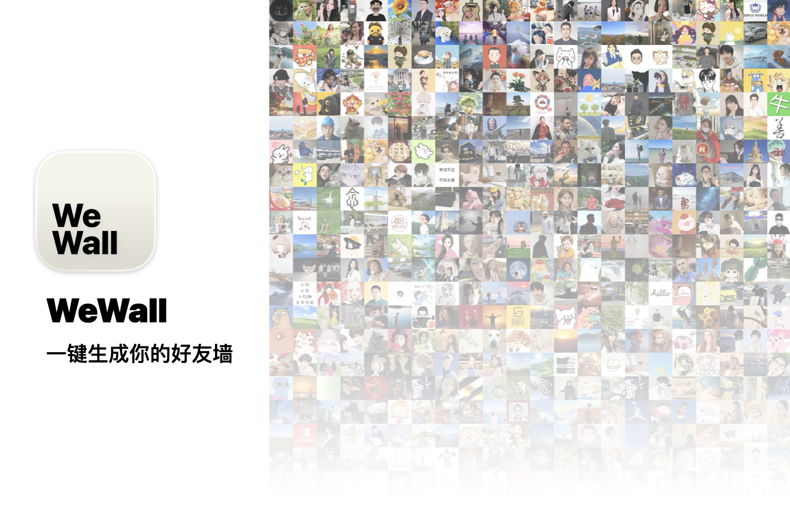
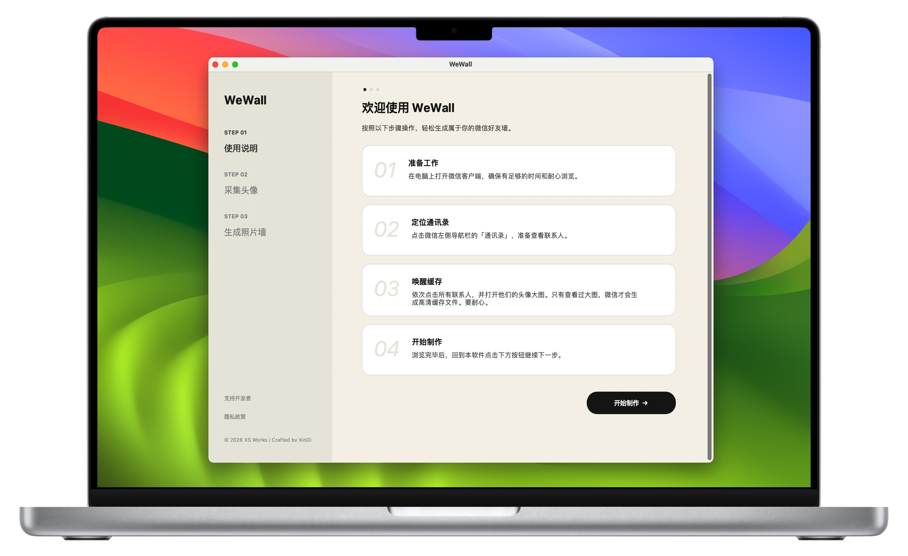

# 🖼️ WeWall

**一款跨平台、智能化的微信好友头像照片墙生成工具**

[✨ 核心功能](#-核心功能) • [🚀 快速开始](#-快速开始) • [🛠️ 运行原理](#-运行原理) • [❓ 常见问题](#-常见问题) • [📜 免责声明](#-免责声明)

---

<!-- 宣传图 -->

## 📖 软件用途

**WeWall** 旨在帮助用户将微信通讯录中的好友头像一键采集并拼接到一起，生成一张精美的“全家福”或“照片墙”。无论是为了祝福、纪念，还是作为社交圈的展示，WeWall 都能以最优雅的方式为你呈现好友群像。

## ✨ 核心功能

- **智能采集**：深度适配 macOS 与 Windows 版微信，自动扫描本地缓存目录，无需繁琐导出。
- **视觉去重**：采用 **dHash (Difference Hash)** 算法，精准识别并过滤内容重复或相似的头像。
- **动态布局**：根据头像数量自动计算最优拼接比例，支持上千张头像同时处理。
- **智能裁剪**：自动识别图片中心区域并进行正方形裁剪，确保每一位好友都能完美入画。
- **跨平台适配**：专为 Mac 和 Windows 设计，提供原生且细腻的用户界面。

## 🛠️ 运行原理

WeWall 的工作流程分为两个核心阶段：

### 1. 深度采集 (Step 1)
软件会扫描微信在本地磁盘生成的缓存文件夹（如 macOS 的 `Containers` 或 Windows 的 `WeChat Files`）。
- **智能筛选**：自动过滤尺寸过小（非头像）、非正方形（非联系人）以及过期的缓存文件。
- **指纹降噪**：计算每张图片的视觉指纹，确保即使用户多次更换头像，导出的照片牆中每个联系人也仅出现一次。

### 2. 艺术拼接 (Step 2)
将采集到的高清头像进行中心对齐裁剪，并按照计算出的矩阵（Grid）进行无缝拼接。
- **性能优化**：内置内存保护机制，防止生成超大规模图片时导致系统崩溃。

## 💼 怎么使用？

1. 打开微信客户端，然后确保你有足够的耐心和时间（非常适合春节时期没事做的时候）。
2. 确保所有联系人的头像都已正确加载。
3. 点击「开始采集」按钮。
4. 采集成功则点击「生成照片墙」按钮。如果采集失败，请看下方的「常见问题」

## ❓ 常见问题

### 为什么采集不到头像？
如果提示“未找到图片”，请尝试：
1. **唤醒缓存**：打开电脑版微信，点击左侧导航栏的 **[通讯录]**，从上到下缓慢滚动一遍所有联系人。
2. **查看大图**：依次点击所有人的头像大图，确保加载清晰后关闭，然后点击下一个联系人，重复这个操作，直至把所有你想缓存的联系人头像都点击完成（**开发者：**我知道这很麻烦，但新版本微信就是这样，头像缓存太难找了！只能挨个把联系人头像点开，手动制造出缓存，这样程序就能读取了）。
3. **再次尝试**：在点开所有联系人的头像后，回到软件再次点击采集头像按钮，应该可以解决问题。

### 真的找不到头像缓存怎么办？
WeWall 提供了一个**手动兜底方案**：
1. 在你的**桌面**新建一个名为 `联系人头像` 的文件夹。
2. 将你想要展示的头像（.jpg 或 .png）手动放入其中。
3. 直接跳到软件的 **[STEP 03]**，点击“生成照片墙”。
4. 开发者：我知道这个办法很笨，但没办法了。

## 🍮 待改善的地方
- 由于我的 Windows 电脑实在太糟糕了，我实在没有心情在上面调试代码，所以如果对于界面外观、运行体验有建议的同学，欢迎直接联系我，我会相应改进。
- 虽然 Windows 版本做的一般，也不代表 Mac 版本做的优秀，由于时间紧迫，还有很多要提高的地方，实在难以称得上杰作。请反馈你们的意见，我会改进。
- 哦对了，请记得在软件内点击「支持开发者」，谢谢！

## 直接下载

1. 在 [Releases](https://github.com/yourusername/WeWall/releases) 页面下载对应系统的压缩包。
2. 解压后双击运行 `WeWall` 可执行程序。

## 免责声明

- 本软件仅作为技术学习与交流使用，**严禁用于任何商业用途**。
- 本软件**不会上传任何用户数据**，所有处理均在本地离线完成。
- 用户需遵循所在地区的法律法规及微信用户协议。

---

  <b>Made with ❤️ by XinDi</b> 
  © 2026 XS Works. All rights reserved.

